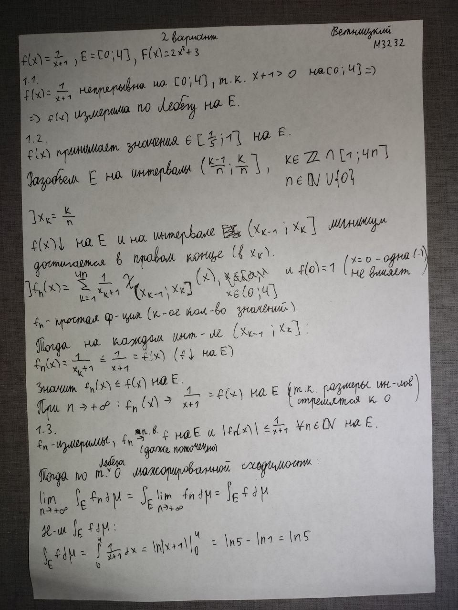
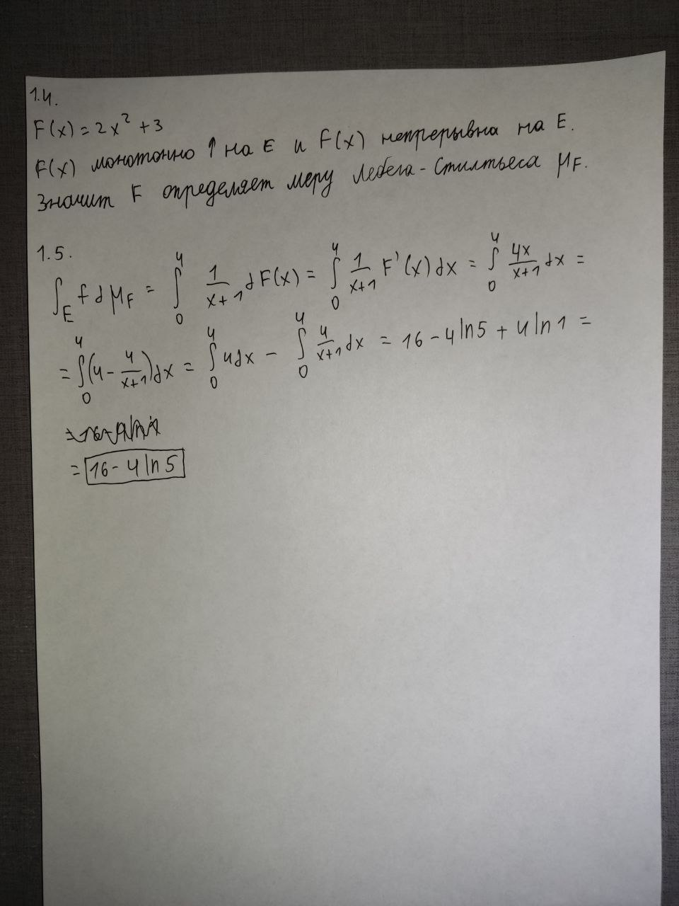
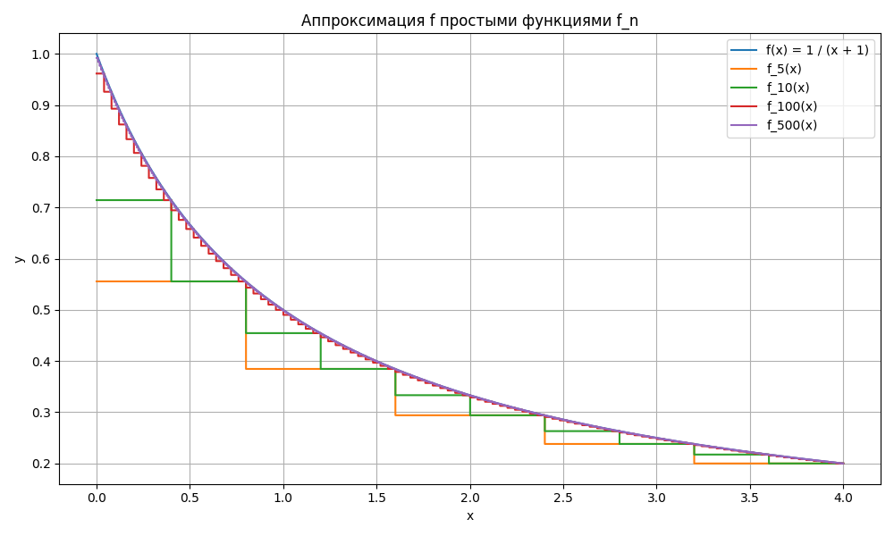
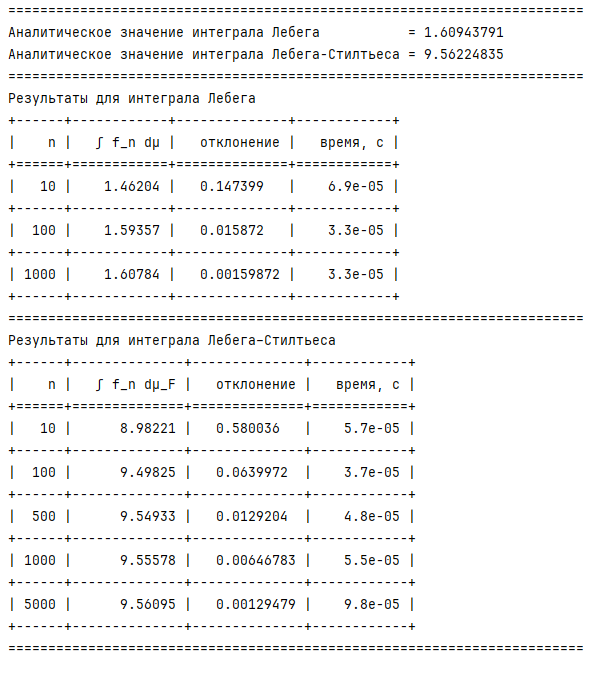

# Лабораторная работа по мат. анализу

**Выполнил:** Ветницкий Владимир \
**Группа:** M3232

---

## Аналитический метод

## Численный метод
Графики функции `f` и функций `f_n` при `n`, равном `5, 10, 100, 500`:

Текстовый вывод программы:

Интегралы Лебега для функций `f_n` считаются при `n`, равном `10, 100, 1000`

Интегралы Лебега-Стилтьеса для функций `f_n` считаются при `n`, равном `10, 100, 500, 1000, 5000`

Полученные значения интегралов, отклонения от результата аналитического метода и
время работы для каждого интеграла при каждом `n` предоставлены в таблицах.

### Вывод
С увеличением `n` отклонение от значения, полученного аналитически, заметно сокращается.
Таким образом, численный метод позволяет быстро находить значения с достаточно высокой точностью.

